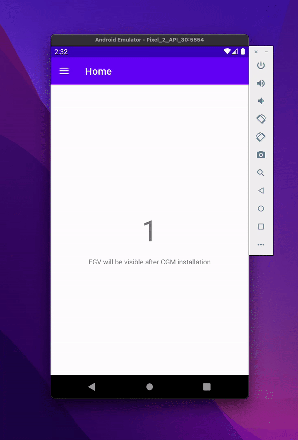

# FakeGlucoseReadings

||||
|:---:|:---:|:---:|

Fake glucose readings application is a very ( very very) simple clone of the application we are currently working on. In order for the customer to bring the application to market, it has to meet a number of requirements, one of which is to cover it with tests and make sure that all the requirements provided by the customer have been implemented in the right way.

## What is this app? ##
This is an app that connects to an external device (sensor) and with its help displays the user's glucose level in real time.

## Requirements ##

**Home View**
Req1. When the sensor is connected, the application should display the glucose level of the main screen
Req2. When the sensor is not connected, we should have "---" on the main screen instead of the glucose value and a note saying that the glucose level will be visible when the sensor is connected

**Manage CGM View**
Req3. When the sensor is not connected, the sensor management screen should show a information saying that the sensor status is NO SENSOR
Req4. When the sensor is connected, the sensor management screen should show a information saying that the sensor status is SENSOR PRESENTED
Req5. When the sensor type is NONE, the button responsible for adding a new sensor should be disabled on the sensor management screen
Req6. When the sensor type is other than NO SENSOR, on the sensor management screen the button responsible for adding a new sensor should be active
Req7. When the sensor has been added and is working, on the sensor management screen, the button responsible for changing the sensor type should be inactive
Req8. When a sensor has been added and is working, on the sensor management screen, the button responsible for adding a sensor should be changed to a button for removing a sensor (it should have a different behavior and icon)
Req9. When the sensor is deleted, a dialog with the message "Sensor has been deleted" should be shown
Req10. When the sensor has been deleted the user should be returned to the main application screen.

**Add Libre2 View**
Req11. When the sensor type is set to Libre2, after pressing the add sensor button on the sensor management screen, the user should be taken to the screen responsible for adding the Libre2 sensor
Req12. On the screen for adding a Libre2 type sensor, the user should see information on how the sensor can be added
Req13. On the screen for adding a Libre2 type sensor, the user should be able to add a sensor by holding down the sensor image
Req14. After adding a Libre2 type sensor, a dialog with the message "Sensor has been added" should be shown.
Req15. Once the Libre2 sensor has been added, the user should be taken back to the sensor management view

**Add Dexcom G6 View**
Req16. When the sensor type is set to Dexcom G6, when you press the add sensor button on the sensor management screen, you should be taken to the screen responsible for adding the Dexcom G6 sensor
Req17. On the screen for adding a Dexcom G6 type sensor, the user should see information on how they can give sensor
Req18. On the screen for adding Dexcom G6 type sensor, the user should be able to enter the transmitter pin code.
Req19. Only the following pin codes should be able to add Dexcom G6 type sensor: 1234, 8888, 4321
Req20. If the pin code is correct the Dexcom G6 type sensor should be added
Req21. When the Dexcom G6 sensor is added, a dialog with the message "Sensor has been added" should be shown.
Req22. When the Dexcom G6 sensor is added, the user should be taken back to the sensor management view
Req23. If the pin code is not correct, a Toast with the message "Wrong pin" should be displayed.

**Switch CGM View**
Req24. The sensor type change screen should show three options: Libre2, G6 and NONE
Req25. If the currently saved sensor type is selected on the sensor mode change screen, the application should not allow you to change the type by locking the SWITCH button
Req26. If a different sensor type than the currently saved one is selected on the sensor mode change screen, the application should allow you to change the type and unlock the Switch button

## What you need to do ##
The purpose of this task is to cover the application with tests and verify that the listed requirements have been implemented. To do this, you need to create the following types of tests:
- Instrumented
- Flow
- Unit Tests

The client requested that for unit tests JUnit should be used along with MockK (a framework for mocking), while for instrumented and flow tests the Espresso framework should be used. In addition, each test should include a comment indicating what requirement it is testing.

## Useful links ##
[MockK](https://mockk.io/)
[Instrumentation tests](https://proandroiddev.com/easy-instrumented-tests-ui-tests-for-android-in-2021-2e28134ff309)
[Unit Tests](https://medium.com/nerd-for-tech/junit-testing-in-android-with-kotlin-for-beginners-hemcrest-and-mockito-b731a74abaea)
[Espresso](https://medium.com/mindful-engineering/ui-testing-with-espresso-in-android-10dfbc9f25da)

## Very important ##
==If any task is not clear to you, or you have a problem with it - just ask for help==